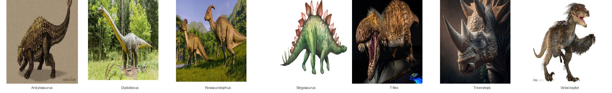
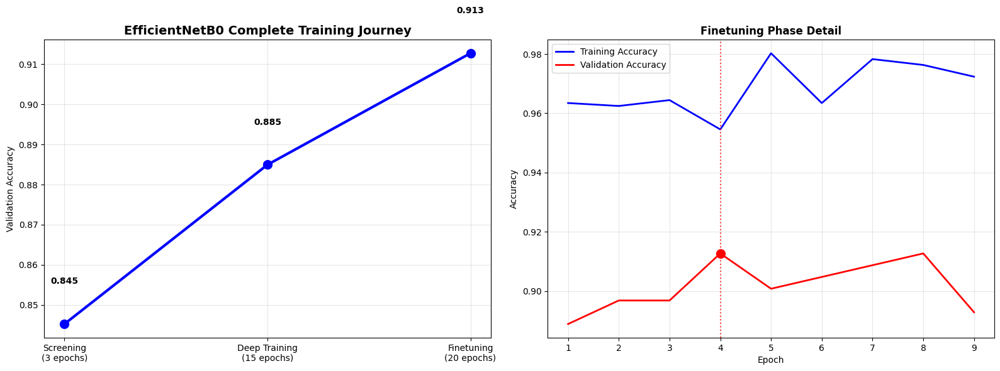
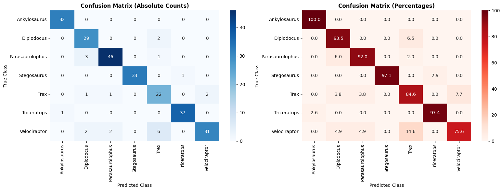
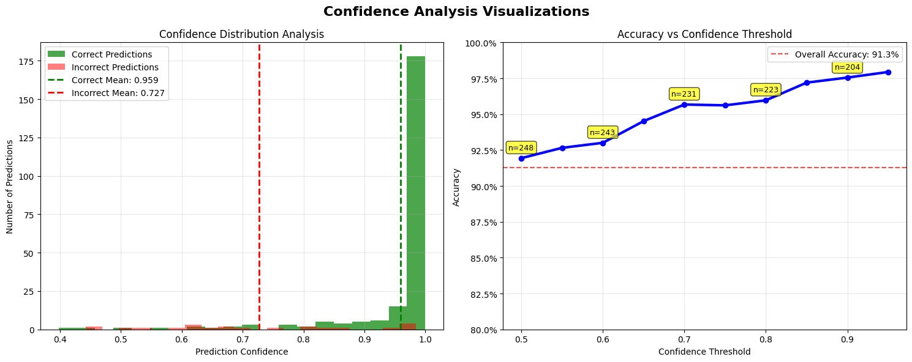
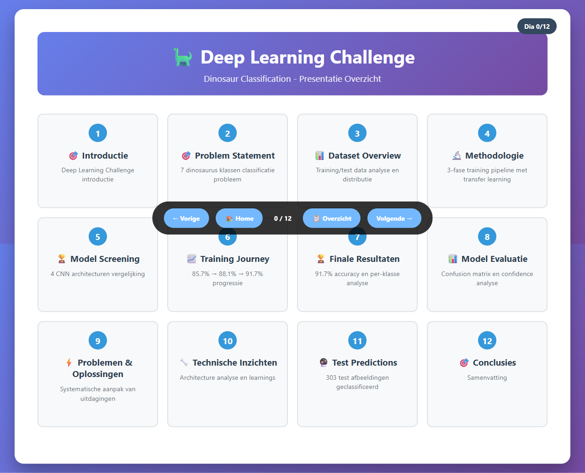
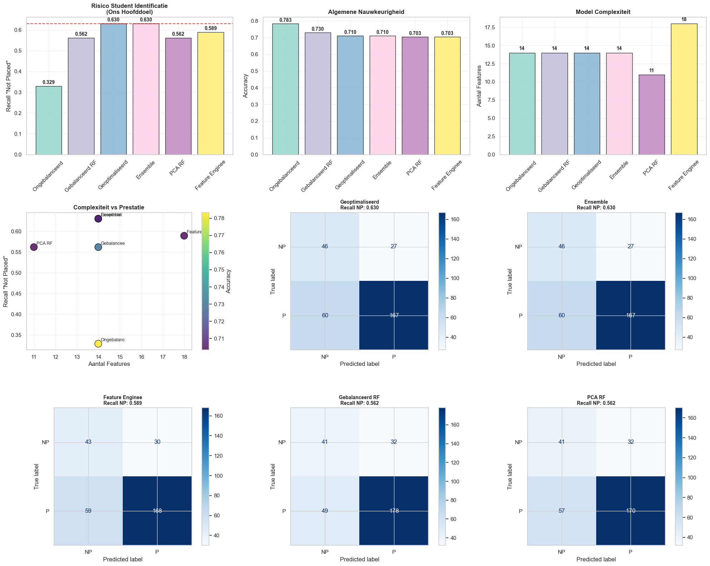
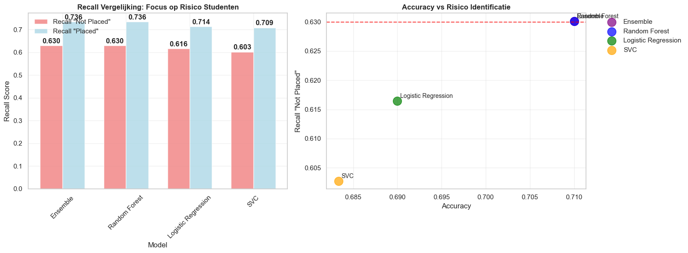

# AI notebooks - machine learning & deep learning challenges

Twee challenges uit de cursus Artificial Intelligence (Thomas More, Toegepaste Informatica). Eindresultaat: **20/20**.

---

## Deep learning challenge: dinosaurus classificatie

Classificatie van dinosaurus afbeeldingen in 7 soorten met behulp van transfer learning (EfficientNetB0). Systematische 3-fase aanpak: screening, deep training en fine-tuning.

**Resultaat: 91.3% validation accuracy**

### Dataset voorbeelden

3 samples per klasse uit de trainingdata (7 soorten, 1264 afbeeldingen):

### Training journey

Progressieve verbetering over drie trainingsfases:

### Model evaluatie

Confusion matrix over 7 klassen - Ankylosaurus (100%) tot Velociraptor (75.6%):

### Confidence analyse

Het model is niet alleen accuraat, maar ook zelfverzekerd bij correcte voorspellingen:

### Aanpak

1. **Screening** - 4 CNN architecturen vergeleken (MobileNetV2, EfficientNetB0, EfficientNetB3, ResNet50V2)
2. **Deep training** - 15 epochs met callbacks (early stopping, learning rate scheduling, checkpointing)
3. **Fine-tuning** - strategisch unfreezen van de laatste 25% layers met lage learning rate

### Presentatie

Interactieve HTML presentatie met 12 slides over de volledige aanpak en resultaten:

### Bestanden

| Bestand | Beschrijving |
|---------|-------------|
| `dl-challenge/dinosaur-classification.ipynb` | Volledig notebook met EDA, training en evaluatie |
| `dl-challenge/presentatie/` | [Interactieve HTML presentatie (12 slides)](https://stijn-portfolio.github.io/ai-notebooks/dl-challenge/presentatie/overzicht.html) |
| `dl-challenge/results/` | Training metrics en voorspellingen (JSON) |
| `dl-challenge/misclassified/` | Voorbeelden van foutieve classificaties |

---

## Machine learning challenge: campus recruitment

Voorspelling van plaatsingsstatus van studenten op basis van academische en demografische kenmerken. Meerdere modellen vergeleken met focus op het identificeren van risicostudenten.

### Model vergelijking

Zes modelvarianten vergeleken op recall, accuracy en complexiteit:

### Recall analyse

Random Forest en Ensemble presteren het best voor risico-identificatie:

### Aanpak

1. **EDA** - distributie, correlaties, outliers
2. **Baseline** - Random Forest als benchmark
3. **Optimalisatie** - hyperparameter tuning, class balancing, feature engineering
4. **Vergelijking** - Random Forest, Logistic Regression, SVM, Ensemble
5. **Bonus** - salarisvoorspelling voor geplaatste studenten (regressie)

### Bestanden

| Bestand | Beschrijving |
|---------|-------------|
| `ml-challenge/campus-recruitment.ipynb` | Volledig notebook met EDA, modellen en evaluatie |
| `ml-challenge/data/CampusRecruitment.csv` | Dataset |
| `ml-challenge/Campus Recruitment Challenge.pptx` | Presentatie |

---

## Technologieen

- Python, Jupyter Notebook
- TensorFlow/Keras (deep learning)
- scikit-learn (machine learning)
- pandas, NumPy, matplotlib, seaborn
